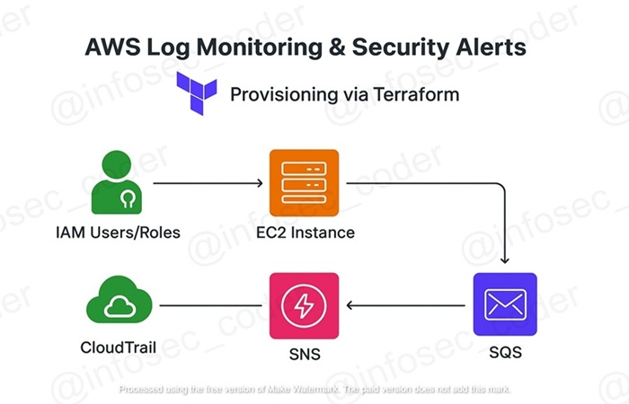

# terraform-log-monitoring-aws-security-alerts
🔁 *Provision AWS infrastructure for monitoring, alerting, and self-healing security setups with Terraform*

---

## 🧭 Project Overview

This Proof of Concept (PoC) provisions a **secure AWS environment** for **log monitoring and automated security alerts** using Terraform.  

It demonstrates **IAM users/roles, EC2 instances, CloudTrail, SNS, SQS, and an optional Application Load Balancer**, simulating a real-world **security monitoring architecture**.

Designed for **hands-on DevSecOps and AWS security experience**, this project is ideal for demonstrating practical skills to recruiters.

---

## 🚀 Key Steps Implemented

- 🖥️ **Provision EC2 instance(s)** to host logging agents or test workloads  
- 🛂 **Create IAM users, roles, and policies** enforcing least privilege  
- 📜 **Enable CloudTrail** for auditing all AWS account activity  
- 🔔 **Set up SNS topic** for publishing security alerts  
- 📥 **Create SQS queue** to receive SNS messages asynchronously  
- 📤 **Attach IAM policies** to allow secure log publishing to SNS/SQS  
- 🧪 **Simulate security events** and validate alert delivery  
- 🧹 **Clean up all resources** to avoid unnecessary costs  

---

## 🧱 Core Infrastructure

| Component               | Description                                                              |
|-------------------------|--------------------------------------------------------------------------|
| 🖥️ EC2 Instance         | Hosts logging agents or workloads generating events                      |
| 🛂 IAM Users & Roles     | Enforces least-privilege access for monitoring & log publishing         |
| 📜 CloudTrail            | Tracks API calls and AWS account activity                                 |
| 🔔 SNS Topic             | Publishes alerts from security events                                    |
| 📥 SQS Queue             | Receives messages from SNS asynchronously                                 |
| ⚖️ IAM Policies          | Grants controlled permissions for publishing to SNS/SQS                  |
| 🗂 Outputs (.env)        | Stores environment variables for scripts or automation                   |

---

## 🧪 Testing & Validation

### ✅ Validation Steps (Mit Ikons)

| 🔢 Step | Goal                                 | Tool/Resource            |
|--------|-------------------------------------|-------------------------|
| 1️⃣     | Deploy Terraform infrastructure      | `terraform apply`       |
| 2️⃣     | Verify IAM users, roles & policies   | AWS Console / CLI       |
| 3️⃣     | Trigger security events              | EC2 logs / CloudTrail   |
| 4️⃣     | Confirm SNS alerts received          | SQS queue subscription  |
| 5️⃣     | Export credentials for scripts       | `.env` file / Bash      |

### 🧠 Security Behavior Confirmations

| 🔍 What to Confirm                         | 📌 Status | 🧾 Evidence Provided                     |
|------------------------------------------|-----------|----------------------------------------|
| IAM policies enforce least privilege      | ✅        | IAM Policy Simulator / CLI tests       |
| CloudTrail logs are generated             | ✅        | Verified in CloudTrail console          |
| SNS notifications are sent correctly      | ✅        | Messages delivered to SQS queue        |
| EC2 instance publishes logs securely      | ✅        | Logs appear in SNS/SQS subscription     |
| Environment variables exported properly   | ✅        | `.env` file content verified            |

---

## 🛡️ Security Monitoring & Alerts

### 🔐 Implemented Resources

- ✅ **IAM Policy Name**: `sns-publish-policy`  
- 👤 **Targeted User**: `log-monitor-publisher`  
- 🔔 **SNS Topic**: `SecurityAlerts`  
- 📥 **SQS Queue**: `SecurityQueue`  
- ⛔ **Access Control**: Least privilege enforced for publishing  

### 🎯 Security Value

| 🔐 | Real-World Security Benefit                                         |
|------|------------------------------------------------------------------|
| 🛠️ | Controlled publishing of logs to alerting systems                 |
| 🌍 | Demonstrates AWS security best practices in infrastructure setup |
| 💼 | Builds skills relevant to DevSecOps & Cloud Security roles       |
| 🚀 | Automates monitoring and alerting for faster incident response  |

---

## 🗂️ Terraform Modules / Files Overview

| File / Module                     | Purpose                                                                 |
|----------------------------------|-------------------------------------------------------------------------|
| `main.tf`                         | Entry point; provisions core resources (EC2, IAM, CloudTrail, SNS/SQS) |
| `variables.tf`                    | Defines input variables for customizing resource names, counts, etc.    |
| `outputs.tf`                      | Exports key values like EC2 public IP, SNS topic ARN, SQS queue URL     |
| `iam.tf`                          | Creates IAM users, roles, and policies for least-privilege access       |
| `ec2.tf`                          | Defines EC2 instance(s) for testing/log generation                      |
| `cloudtrail.tf`                   | Enables CloudTrail for auditing AWS account activity                    |
| `sns_sqs.tf`                      | Creates SNS topic and SQS queue; attaches subscriptions and policies    |
| `security_groups.tf`              | Sets up security groups for EC2 and networking                          |
| `provider.tf`                     | Configures AWS provider and region                                      |
| `terraform.tfvars` (optional)     | Overrides default variable values for this environment                  |

> 💡 **Tip:** Each module is modular and can be applied independently for partial deployments or testing.

---

## 🧹 Clean-Up Checklist

- 🧼 Delete IAM users, roles, and policies created for testing  
- 💻 Terminate EC2 instance(s) to avoid ongoing costs  
- 🔔 Remove SNS topic and SQS queue if no longer needed  
- 📄 Delete exported `.env` file or sensitive outputs  
- 📉 Purge CloudTrail logs if testing in a personal account  

---

## 🎯 Learning Outcomes

- 🔁 Demonstrated **secure AWS infrastructure deployment** using Terraform  
- 🛡️ Implemented **log monitoring and alerting** with SNS, SQS, and CloudTrail  
- 📦 Applied **least-privilege IAM policies** for secure operations  
- 🧪 Validated **alert delivery** and infrastructure behavior under test events

